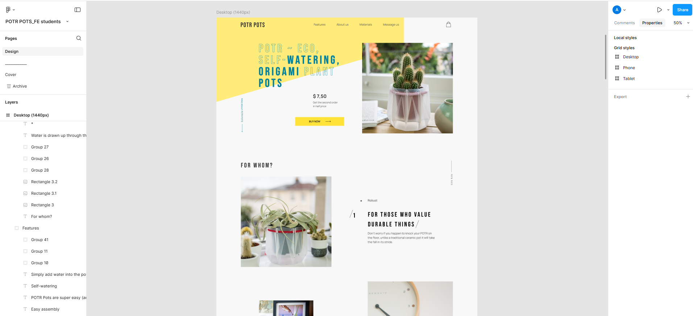

---

## **POTR POTS landing page**

_POTR POTS is a responsive landing page created as part of my web development portfolio. The page is designed for UK-based company that produces sustainable, self-watering plant pots made from recycled materials. The goal of the project was to create an engaging and modern web presence that highlights the company’s eco-friendly mission and innovative products._

## **Demo**

🔗 [**Live Preview**](https://alina-kabanets.github.io/Potr_Pots/)

## **Design Reference **

🖼 [**Figma Mockup**](https://www.figma.com/design/50zgLU65Mcd3MisFHMfLfx/POTR-POTS_FE-students?node-id=1760-281)

## **🛠️ Technologies Used**

- **HTML5: Semantic and accessible markup.**
- **CSS3 / SCSS: Modular and maintainable styles with responsive design principles.**
- **JavaScript (ES6+): Dynamic interaction and Swiper carousel integration.**
- **SwiperJS: Smooth, customizable sliders for showcasing products.**
- **GitHub Pages: Deployed and hosted for easy access and testing.**

## 🚀 **Features**

- 🔥 Responsive Design: Ensures seamless user experience across desktops, tablets, and mobile devices.
- 🎨 Swiper Integration: Interactive and smooth product sliders powered by SwiperJS.
- ⚡ Dynamic Elements: Engaging animations and transitions for an enhanced user experience.
- ✨ Optimized Performance: Clean and efficient code with a focus on speed and accessibility.
- 📌 Cross-Browser Compatibility: Ensures consistent functionality across modern browsers.

## 📸 **Screenshots**



## 🤝 **Contributing**

Contributions, issues, and feature requests are welcome! Feel free to open a pull request or submit feedback.

## 📧 **Contact**

If you have any questions or suggestions, feel free to reach out:

LinkedIn: https://www.linkedin.com/in/alina-kabanets/

GitHub: https://github.com/alina-kabanets

---

## 📦 **Getting Started**

Follow these steps to set up the project locally

### 1\. **Clone the repo**

```bash
git clone https://alina-kabanets.github.io/Potr_Pots/
cd project-name
```

### 2\. **Install dependencies**

```bash
npm install
# or
yarn install
```

### **3\. Run the project locally**

```powershell
npm start
# or
yarn start
```

---
